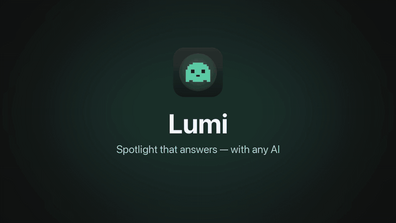

# Lumi

[English](README.md) · [Русский](README.ru.md) · [Deutsch](README.de.md) · **Español** · [Français](README.fr.md)

**Una barra al estilo de Spotlight para macOS y Windows que además responde preguntas.** Con un atajo abres una aplicación o un archivo, o preguntas a Claude, ChatGPT, Gemini, un modelo local o cualquier otra IA que conectes. Antes se llamaba ClaudeLight.



📢 **Novedades y actualizaciones — canal de Telegram (en ruso): [t.me/+3IU-_WIhrTU4MjAy](https://t.me/+3IU-_WIhrTU4MjAy)**

| | macOS | Windows |
|---|---|---|
| Descargar | [`Lumi-macOS.dmg`](https://github.com/AlbertS15/Lumi/releases/latest) | [`Lumi-Setup.exe` o `Lumi-Portable.exe`](https://github.com/AlbertS15/Lumi/releases/latest) |
| Atajo | **⌥ + la tecla a la izquierda del 1** | **Alt + la tecla a la izquierda del 1** (`` ` ``, º, Ё, ^ — cualquier distribución) |
| Solo el código de esta plataforma | rama [`macos`](https://github.com/AlbertS15/Lumi/tree/macos) | rama [`windows`](https://github.com/AlbertS15/Lumi/tree/windows) |

Interfaz en cinco idiomas: English, Русский, Deutsch, Español, Français (por defecto, el del sistema).

> Proyecto independiente, sin relación con Anthropic, OpenAI ni Google. Claude, ChatGPT y Gemini son marcas de sus propietarios.

## Funciones

- **Búsqueda** de aplicaciones y archivos: el índice de Spotlight en Mac, el menú Inicio y Windows Search en Windows. Lumi distingue sola una búsqueda de una pregunta.
- **Respuestas en la propia barra**, que se escriben a medida que llegan; las preguntas de seguimiento continúan la conversación.
- **Suscripciones sin claves de API**, mediante las herramientas oficiales de cada servicio:
  - Claude — [Claude Code](https://claude.com/claude-code) (`claude`): Haiku, Sonnet, Opus, Fable;
  - ChatGPT Plus — [Codex CLI](https://github.com/openai/codex) (`codex login`);
  - Gemini — [Gemini CLI](https://github.com/google-gemini/gemini-cli) (inicio de sesión con Google; 3.1 Pro, 3.8 Flash, 3.1 Flash-Lite).
- **Preguntar en ChatGPT** (⇧⌘↩ / Ctrl+Mayús+Intro) abre chatgpt.com con tu pregunta.
- **Cualquier servicio compatible con OpenAI**: OpenRouter, OpenAI, DeepSeek, Groq, Mistral, YandexGPT, GigaChat.
- **Modelos locales** con Ollama y LM Studio: gratis, sin conexión y en cualquier país.
- Las claves se guardan en el Llavero de macOS o cifradas por Windows. Icono en la barra de menús o en la bandeja, ventana de bienvenida, inicio con la sesión y desinstalación en un clic.

## macOS

**Instalación.** Descarga `Lumi-macOS.dmg` desde [Releases](https://github.com/AlbertS15/Lumi/releases/latest) y arrastra Lumi a Aplicaciones. La app no está firmada con un certificado de Apple, así que la primera vez: clic derecho → Abrir → Abrir.

**Actualización.** Descarga la nueva versión y sustituye la anterior. Si tienes ClaudeLight, Lumi lo cierra, lo mueve a la Papelera y conserva los ajustes.

**Desinstalación.** Ventana de bienvenida o menú del fantasma en la barra de menús → «Desinstalar Lumi…».

**Compilar desde el código.** Requiere macOS 14+ y las Command Line Tools de Xcode (`xcode-select --install`):

```bash
./build.sh
```

Compila `build/Lumi.app` y lo instala en `~/Applications`. Código: `Sources/` (AppKit + SwiftUI); el icono lo dibuja `Icon/make_icon.swift`.

## Windows

**Instalación.** Desde [Releases](https://github.com/AlbertS15/Lumi/releases/latest), descarga el instalador `Lumi-Setup-….exe` (no requiere permisos de administrador) o `Lumi-Portable-….exe` (sin instalación). Si SmartScreen avisa de un editor desconocido: «Más información» → «Ejecutar de todas formas».

**Actualización.** Ejecuta el nuevo instalador: sustituye la versión anterior, también ClaudeLight, y conserva los ajustes y el inicio con Windows.

**Desinstalación.** Configuración → Aplicaciones → Lumi → Desinstalar.

**Compilar desde el código.** Requiere el SDK de .NET 8:

```powershell
dotnet publish windows/Lumi/Lumi.csproj -c Release -r win-x64 --self-contained -p:PublishSingleFile=true -o dist/app
```

El instalador se genera con [Inno Setup](https://jrsoftware.org/isinfo.php) a partir de `windows/installer/Lumi.iss`. Código: `windows/Lumi/` (WPF, .NET 8).

## Teclas

| Tecla | Acción |
|---|---|
| ↩ | abrir el archivo o preguntar al modelo |
| ⌘↩ / Ctrl+↩ | preguntar siempre al modelo |
| ⇧⌘↩ / Ctrl+Mayús+↩ | preguntar en ChatGPT |
| ⌥↩ / Alt+↩ | mostrar el archivo en el Finder / Explorador |
| ↑ ↓ | elegir un resultado |
| ⌘C / Ctrl+C | copiar la respuesta |
| esc | detener la respuesta, volver, cerrar |

## Para desarrolladores

- `main` contiene las dos aplicaciones; todos los cambios van aquí.
- `macos` y `windows` contienen una plataforma cada una. GitHub Actions las regenera con cada cambio en `main`; no las edites a mano.
- `strings/strings.json` reúne todos los textos de la interfaz en todos los idiomas. Tras editarlo, ejecuta `python3 strings/generate.py`.

Cómo publicar una versión: consulta el [README en inglés](README.md#for-developers).

## Licencia

[MIT](LICENSE) © 2026 AlbertS15
